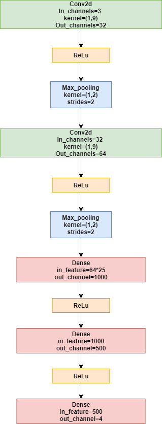

# Human Activity Recognition
*Haiquan Wang, Li Yi, Zhicheng Ye*
## Table of Contents

*  [Abstract](#Abstract)
*  [Requirement](#Requirement)
*  [Usage](#Usage)
*  [Network](#Network)
*  [Result](#Result)


## Abstract

This repo is HAR-CNN code


## Requirement
Pytorch 1.x

Scikit-learn

tqdm

## Usage
Fistly, we can set some necessary configurations in `config.py`.
Configuration Table
|Config|Value|Description|
|:-:|:-:|:-:|
|epoch|50|-|
|lr|0.001|-|
|momentum|0.9|-|
|batch_size|64|-|
|linke_train|./linke_train/|training dataset directory|
|linke_test|./linke_test/|testing dataset directory|
|result_file|result.csv|the file that stores training result|

Then begin to train network by following command:
```sh
[username:/home/workspace/IoT]$ python main_pytorch.py
```

## Network



## Result
Training Accuracy: 91.26%
Testing Accuracy: 90.26%


## Reference
Reference repo: [https://github.com/jindongwang/Deep-learning-activity-recognition](https://github.com/jindongwang/Deep-learning-activity-recognition`)
